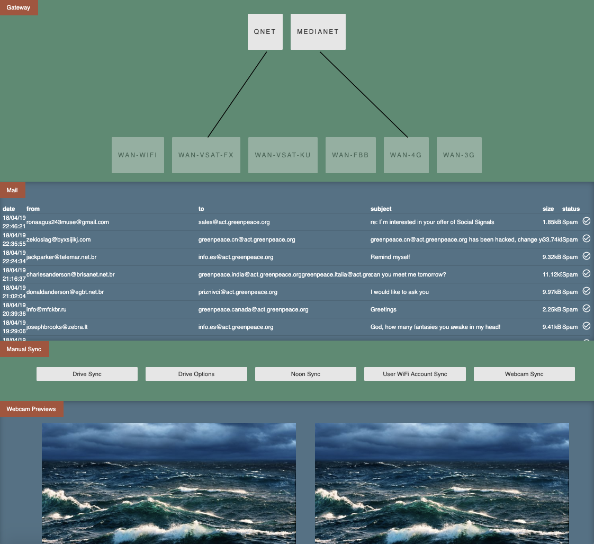

# CNC for ships
Unifying the control of ships networking, file-sharing, mail-curation, wifi-user sync and webcam-syncing

### Requirements:
1. git
2. node/npm

### Installation:
1. `git clone git@github.com/greenpeace/global-ops-cnc.git`
2. `mv global-ops-cnc /opt/`
3. `cd /opt/global-ops-cnc`
4. `mv settings-example.json settings.json`
5. Set global vars json file `settings.json`
6. `npm install`
7. `npm install forever -g` installs forever globally to keep the service running
8. `npm install forever-service -g` installs forever-service globally to create forever services
9. `forever-service install cnc --start --script /opt/global-ops-cnc/index.js` starts the service (for reboots)
10. open port 8080 or whichever port specified in `settings.json`

### Usage:
In your browser navigate to whatever IP of the machine you are running on, or assign a DNS entry to that ip, followed by the port specified in `settings.json`. Use the admin password specified in `settings.json`.

### Upgrading
1. `cd /opt/global-ops-cnc && git pull`
2. `forever-service delete cnc`
3. `forever stopall`
3. `forever-service install cnc --start --script /opt/global-ops-cnc/index.js`

### Stopping the service / uninstalling
1. `sudo forever-service delete cnc`
2. `rm -r /opt/global-ops-cnc`
